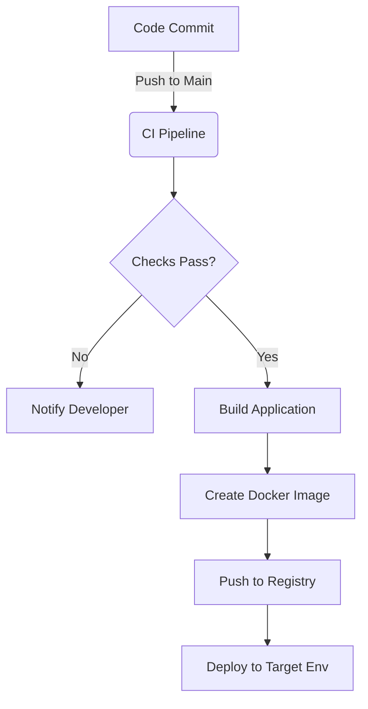

# DevOps & Deployment Guide

This document outlines the DevOps practices, build processes, and deployment strategies for the **Form Engine Backend** project.

## 1. Technology Stack

- **Runtime**: [Bun](https://bun.sh/)
- **Framework**: [ElysiaJS](https://elysiajs.com/)
- **Language**: [TypeScript](https://www.typescriptlang.org/)
- **Database**: [PostgreSQL](https://www.postgresql.org/)
- **ORM**: [Prisma](https://www.prisma.io/)
- **Auth**: [Better Auth](https://www.better-auth.com/)
- **Logging**: [Pino](https://github.com/pinojs/pino)
- **Testing**: [Bun Test](https://bun.sh/docs/cli/test)
- **Linting**: [Biome](https://biomejs.dev/)
- **API Client**: [Bruno](https://www.usebruno.com/)

## 2. Local Development Setup

### Prerequisites
- **Node.js**: v18+ (Recommended for some tools)
- **Bun**: Latest version (`curl -fsSL https://bun.sh/install | bash`)
- **Docker**: For running the database locally.

### Installation
Clone the repository and install dependencies using Bun:
```bash
git clone <repository-url>
cd form-engine-backend
bun install
```

### Database Setup
Start the PostgreSQL database using Docker Compose:
```bash
docker-compose up -d
```
Generate the Prisma client:
```bash
bunx prisma generate
```

### Running the Dev Server
The server will start on port `8000`.
```bash
bun run dev
```

## 3. Code Quality & Testing

Ensure code quality before pushing changes.

### Linting & Formatting
Used Biome for both linting and formatting.
```bash
# Check for linting/formatting errors
bun run check

# Fix auto-fixable issues
bunx biome check --write
```

### Type Checking
TypeScript validation:
```bash
bun run typecheck
```

### Testing
Run unit tests via Bun Test:
```bash
# Run tests
# Run tests (Coverage enabled by default in bunfig.toml)
bun test
```

### API Documentation & Testing
The project uses [Bruno](https://www.usebruno.com/) for API documentation and testing.
- Collections are located in the `./bruno` directory.
- Open the `./bruno` folder in the Bruno app to view and run API requests.

## 4. Build Process

The project is built using Bun's bundler, targeting the Bun runtime.

```bash
bun run build
```
**Output**:
- Directory: `./dist`
- Artifact: `dist/index.js`
- Target: Bun (minified)

## 5. Containerization (Docker)

To containerize the application for deployment (e.g., for Kubernetes or Cloud Run), use the following configuration.

### Recommended `Dockerfile`
Create a file named `Dockerfile` in the root:

```dockerfile
FROM oven/bun:1 AS base
WORKDIR /app

# install dependencies into temp directory
# this will cache them and speed up future builds
FROM base AS install
RUN mkdir -p /temp/dev
COPY package.json bun.lock /temp/dev/
RUN cd /temp/dev && bun install --frozen-lockfile

RUN mkdir -p /temp/prod
COPY package.json bun.lock /temp/prod/
RUN cd /temp/prod && bun install --frozen-lockfile --production

# copy node_modules from temp directory
# then copy all (non-ignored) project files into the image
FROM base AS prerelease
COPY --from=install /temp/dev/node_modules node_modules
COPY . .

# [optional] tests & build
ENV NODE_ENV=production
RUN bun test
RUN bun run build

# copy production dependencies and source code into final image
FROM base AS release
COPY --from=install /temp/prod/node_modules node_modules
COPY --from=prerelease /app/dist/index.js index.js
COPY --from=prerelease /app/package.json package.json

# run the app
USER bun
EXPOSE 8000/tcp
ENTRYPOINT [ "bun", "run", "index.js" ]
```

### Recommended `.dockerignore`
```text
node_modules
dist
.git
.env
```

## 6. CI/CD Strategy

We use GitHub Actions to validate code on every Pull Request.

### GitHub Actions Workflow
The workflow is defined in `.github/workflows/backend-ci.yml`.

**Key Steps:**
1. **Checkout code**: Pulls the code from the repository.
2. **Setup Bun**: Installs the Bun runtime.
3. **Cache dependencies**: Caches `node_modules` and database-related artifacts to speed up builds.
4. **Install dependencies**: `bun install`.
5. **Generate Prisma client**: Generates the type-safe database client.
6. **Code quality check**: Runs `bun run check` (Biome).
7. **Type checking**: Runs `bun run typecheck`.
8. **Run database migrations**: Applies Prisma migrations to the test database.
9. **Security audit**: Runs `bun audit`.
10. **Build application**: Runs `bun run build`.
11. **Build verification**: Ensures the built artifact can start.
12. **Upload artifacts**: Saves the `dist` directory.

## 7. DevOps Strategy Overview

The following diagram illustrates the automated DevOps pipeline from code commit to deployment.



## 8. Component Deployment Strategy

This section details the source, deployment target, and validation checks for each major component.

### Backend API (`form-engine-backend`)

| Attribute | Description |
| :--- | :--- |
| **Source Code Repo** | `form-engine-backend` (Git) |
| **Deployment Location** | Docker Container in Kubernetes / Cloud Run / VPS |
| **Tools & Platforms** | **Docker** (Containerization), **GitHub Actions** (CI/CD), **Bun** (Runtime) |
| **Pre-Deployment Checks** | 1. **Linting**: `bun run check`<br>2. **Type Checking**: `bun run typecheck`<br>3. **Unit Tests**: `bun test`<br>4. **Security Audit**: `bun audit`<br>5. **Build Verification**: `bun run build` |

### Database (`PostgreSQL`)

| Attribute | Description |
| :--- | :--- |
| **Source Definition** | `prisma/schema.prisma` in `form-engine-backend` Repo |
| **Deployment Location** | Managed PostgreSQL Service (e.g., AWS RDS, Supabase) or StatefulSet |
| **Tools & Platforms** | **Prisma** (ORM & Migrations), **PostgreSQL 17** (Database Docker Image) |
| **Pre-Deployment Checks** | 1. **Schema Validation**: `bunx prisma validate`<br>2. **Migration Status**: `bunx prisma migrate status`<br>3. **Migration Apply**: `bunx prisma migrate deploy` (during deployment) |

## 9. Tools & Ecosystem

The following tools and libraries are standardized for this project's DevOps lifecycle:

- **Source Control**: [GitHub](https://github.com/Nandgopal-R/form-engine)
